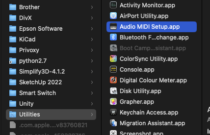
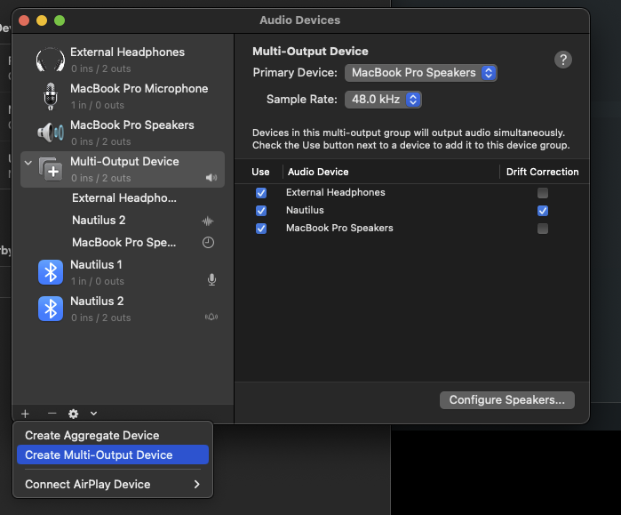

# DER LETZTE DREHBUCHAUTOR - FAKE HOME ASSISTANT
  
## ADJUST BRIGHTNESS
  Turn knob on the underside with the screwdriver anytime. If there is no sound, there is no light, which might be confusing. Press the button on the underside during playback and
  the top light will be lit (and the lower light is blue). Adjust the knob until satisfied, press the button again to save.
  
## ADJUST ANGRYNESS
  This describes how accurately the lights flicker during playback. Max right, slow fading lights. Full left, its quite nervous and jitters a lot.

## CALIBRATE MAX VOULME
  This helps if your sound source is quiet.
  During startup, the KI lights up yellow for 3 seconds. Press the button on the underside during that.
  The lower light ring will be red and the top light is an approximation that reflects the current sounds received over Bluetooth.
  Play a sound until you have played the desired maximum loudness level - this is now set to "full brightness". Press the button again to save the played maximum loudness level.
  
## TOP LIGHT/LOWER LED RING AND LEFT/RIGHT AUDIO CHANNELS
  Lower and upper LED ring are animated according to left/right audio channels to make it more organic.
  The right audio channel lights up *mostly* the top.
  The left audio channel lights up *both* the upper as well as the lower LED rings.

  The top ring lights up if either left or right audio channel is playing something.
  The bottom ring lights up *mostly* if audio is playing on the right, it will ignore sounds on the left.
  
## BLUETOOTH
  Connect to "UGREEN" BT device with MAC. Rename it for further use to something fancy.
  
## PLAYBACK
  On MAC, open the default program "Audio Midi Setup.app" (under Programs/utilities/).
  - Add a new device ("Plus" on bottom left: "Create Multi output device")
  - Add the BT UGREEN Speaker to it and the secondary device you want to hear something - "MacBook Speakers" or "external headphones" (jack 3.5mm)
  - check all the boxes "use" and "Drift correction"
  - Balance and volume per device are now adjustable when you click on the "MacBook Speakers" bzw BT device in the left column (not on the multi output devic e itself)
  - Right click on the "Multi output device" in the list and click "use this device for sound output".

