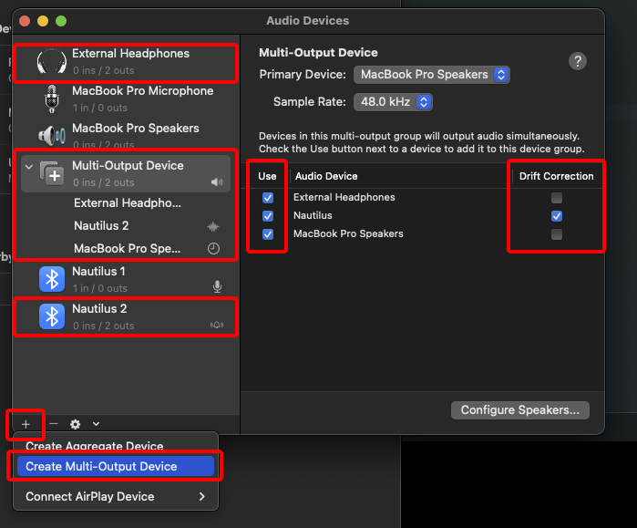

# DER LETZTE DREHBUCHAUTOR - KI_

# GENERAL

## ADJUST BRIGHTNESS
  Turn the "brightness" knob on the underside with the screwdriver anytime to adjust the max ***and*** min brightness. If there is no sound, there is no light, which might be confusing. Press the button on the underside during startup/restart to get a sinus wave fading effect for calibration of brightness or camera tests. Restart (off-on again) without pressing the button.

## SENSITIVITY
  The "sensitivity" knob on the bottom controls the breakpoint (which loudness should trigger the lights). If the voice is faint and should trigger, tune it. If the voice is loud, tune it differently. This also controls how much noise to filter out.

## TURN DEVICE "OFF"
  After the first sound occured, the device is lit up. This imitates a state of readiness.
  To reset after a take, press the button on the bottom once. The device is now "off" and waits for the first audio to occur again.

# PLAYBACK

## BLUETOOTH
  Connect to "UGREEN" BT device with MAC. Rename it for further use to something fancy.

## AUDIO MIDI SETUP
  On MAC, open the default program "Audio Midi Setup.app" (under Programs/utilities/).
  

  Add a new device ("Plus" on bottom left: "Create Multi-Output device")
  

  Add the BT UGREEN Speaker to it and the secondary device you want to hear something - "MacBook Speakers" or "external headphones" (jack 3.5mm)

  check all the boxes "use" and "Drift correction"

  Balance and volume per device are now adjustable when you click on the "MacBook Speakers" bzw BT device in the left column (not on the multi output devic e itself)

  Right click on the "Multi output device" in the list and click "use this device for sound output".

  BE SURE TO TURN THE VOLUME UP TO THE MAX ON THE OUTPUT BT DEVICE. IF POSSIBLE, CONTROL THE SOUND OUTPUT OF HIGHER FREQUENCIES LOUDER THAN LOWER FREQUENCIES.

### Known problems
  - Cannot change volume with keyboard of the MAC (set volume of MAC in the "Audio Midi Setup.app" device list)

### Troubleshooting
  Have an audio mp3 ready to play for testing (or check out [this youtube video](https://youtu.be/CEx2fPn-_UE?si=wfVWxz2ufVkPRJ_Z&t=9)).
  - Check if no devices are greyed out in the list of "Audio Midi Setup.app" - outherwise, follow steps below.
  - Turn off BT, turn on again
  - Disconnect / Connect BT speaker
  - Restart "Audio Midi Setup.app" (necessary more than you think for the initial connection)

## BE SURE TO TURN THE VOLUME UP TO THE MAX ON THE OUTPUT:
  

## ZOOM
  From receiver end (laptop on set):
  - Settings > Audio > Speaker: "Same as System"
  - Settings > Audio > Notice "Output volume"
  - Start call; enable microphone; disable camera; hide Zoom App (cmd + h)

  From caller end (laptop actress):
  - check & max out microphone input level

  
